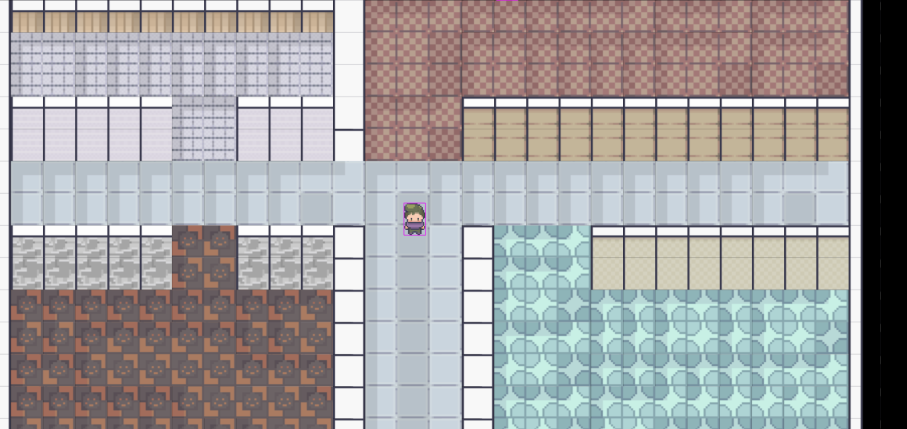
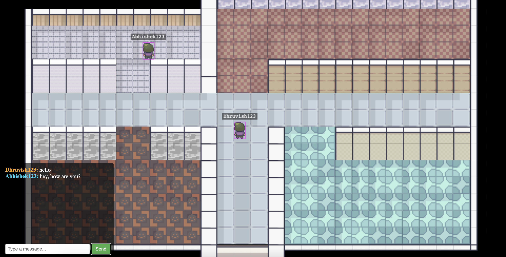
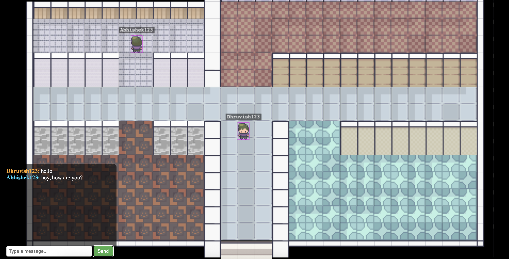

# 🧩 # 🎮 LobbyBase — Real-Time Multiplayer Starter Kit

A scalable real-time multiplayer **lobby system template** — built with **React**, **Phaser**, **Node.js**, **WebSockets**, and **JWT Auth**.

This repo is intended as a **starter kit** for multiplayer developers.  
You can fork and add chat, games, video, avatars, or anything interactive.

> 🎯 Designed for extensibility and performance

---

## 🎥 Demo Video

[](https://www.youtube.com/watch?v=tyPLGJpJS0s)


---

## 🚀 Features

- 🔒 Secure login with JWT (access + refresh tokens)
- 🧠 MongoDB for user management
- 💡 Redis cache (minimal DB reads)
- 📡 Real-time player sync via WebSockets
- 🕹 Built on Phaser 3 game engine
- 🌐 Modular folder structure
- ✅ Battle-tested with 600 virtual users (see below)

---
## 🖼️ Screenshots

### 🧑‍💼 Virtual Office View  


### 💬 In-Game Chat  


### 👥 Multiplayer + Messaging  


---

## 🔧 Tech Stack

| Layer       | Stack                              |
|-------------|-------------------------------------|
| Frontend    | React + Phaser                      |
| Backend     | Node.js + Express + TypeScript      |
| Real-Time   | WebSocket (custom protocol)         |
| Database    | MongoDB                             |
| Caching     | Redis                               |
| Auth        | JWT (access & refresh tokens)       |

---

## 🚀 Local Setup

### 1. Prerequisites

- [Node.js](https://nodejs.org/)
- [MongoDB](https://www.mongodb.com/)
- [Redis](https://redis.io/)
- (Optional) MongoDB Compass

---

### 2. Start Required Services

```bash
# Start MongoDB
brew services start mongodb-community
# OR
mongod --dbpath ~/data/db

# Start Redis
brew services start redis
# OR
redis-server
```
---

### 3. Backend Setup

```bash
cd /path/to/backend
npm install
```

Create a .env file in the root of the backend folder with the following content:

```bash
JWT_SECRET=your_jwt_secret
JWT_REFRESH_SECRET=your_jwt_refresh_secret
MONGO_URI=mongodb://localhost:27017/office-simulator
PORT=5001
```

Then run the backend server:

```bash
npm run dev
# OR
npx ts-node src/server.ts
```

### 4. Frontend Setup

```bash
cd /path/to/client
npm install
npm start
```

### 5. Run the Game

- Open your browser and go to: http://localhost:3000

- Register a new user

- Log in and create or join an rookm

- Navigate to /game/:officeCode to enter the virtual room

---

## 📊 Performance Benchmark

Load tested with [Artillery](https://artillery.io) on a MacBook Air (M1, 8GB RAM).

- 🧑‍🤝‍🧑 600 simulated players
- 💬 1,200 WebSocket messages
- ⚡ 40 msg/sec throughput
- ❌ 0 failures
- 🔁 Session length: ~5s per user


---

