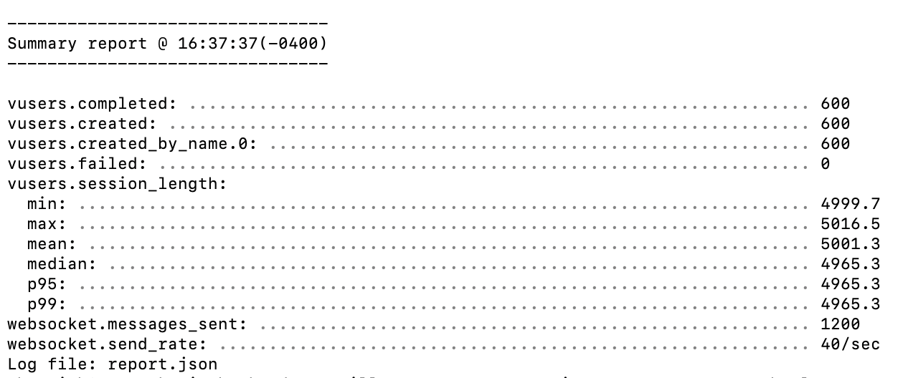

# 🧩 Multiplayer Lobby Template (Phaser + WebSocket + JWT)

A scalable real-time multiplayer **lobby system template** — built with **React**, **Phaser**, **Node.js**, **WebSockets**, and **JWT Auth**.

This repo is intended as a **starter kit** for multiplayer developers.  
You can fork and add chat, games, video, avatars, or anything interactive.

> 🔧 Currently working on: In-game message system  
> 🎯 Designed for extensibility and performance

---

## 🎬 Demo (Coming Soon)

> A short demo showing two players joining a lobby and moving in real-time will be added here.

---

## 🚀 Features

- 🔒 Secure login with JWT (access + refresh tokens)
- 🧠 MongoDB for user management
- 💡 Redis cache (minimal DB reads)
- 📡 Real-time player sync via WebSockets
- 🕹 Built on Phaser 3 game engine
- 🌐 Modular folder structure
- ✅ Battle-tested with 600 virtual users (see below)

---

## 📊 Performance Benchmark

Load tested with [Artillery](https://artillery.io) on a MacBook Air (M1, 8GB RAM).

- 🧑‍🤝‍🧑 600 simulated players
- 💬 1,200 WebSocket messages
- ⚡ 40 msg/sec throughput
- ❌ 0 failures
- 🔁 Session length: ~5s per user



---

## 📁 Folder Structure

```bash
client/       # React + Phaser frontend
backend/      # Express API + WebSocket server
game/         # Phaser game scene logic
routes/       # Auth and game routes
models/       # Mongoose schemas
middleware/   # Auth middleware
benchmarks/   # Load test JSON + graph
